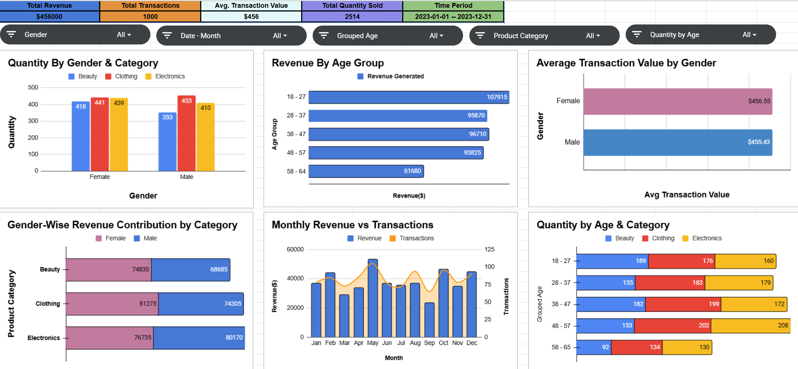

# Interactive Sales Dashboard

📊 An interactive sales dashboard designed to provide insights into **revenue, transactions, and customer demographics**.  
This project highlights how data can be visualized to support decision-making in sales and marketing.

---

## 📌 Features
- **Key Metrics**: Total Revenue, Total Transactions, Average Transaction Value, and Total Quantity Sold.  
- **Demographic Insights**:
  - Revenue and quantity analysis by **gender** and **age group**.  
  - Average transaction value comparison by gender.  
- **Category Analysis**: Product-wise sales breakdown (Beauty, Clothing, Electronics).  
- **Trends**: Monthly revenue vs. transactions to track seasonality and customer behavior.  
- **Visualizations**: Bar charts, combo charts, and comparative revenue contribution charts.  

---

## 📂 Contents
- `Sales_Dashboard.pdf` → Exported version of the interactive dashboard.  
- Supporting visuals/charts included in the PDF.  

---

## 🚀 Use Cases
- Demonstrates ability to **analyze and visualize sales data** effectively.  
- Showcases **dashboard design skills** for business analytics and reporting.  
- Useful for **business stakeholders** to quickly interpret customer and sales trends.  

---

## 🖼️ Preview  

---
Personal Note - Prefer opening in Google sheets else the charts arent visible perfectly

